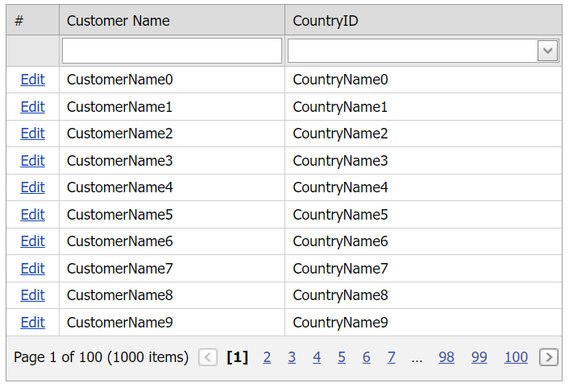

<!-- default badges list -->

[](https://supportcenter.devexpress.com/ticket/details/E4976)
[](https://docs.devexpress.com/GeneralInformation/403183)
<!-- default badges end -->
# Grid View for ASP.NET MVC - How to use a combo box column in callback mode
<!-- run online -->
**[[Run Online]](https://codecentral.devexpress.com/e4976/)**
<!-- run online end -->

This example demonstrates how to create a column editor, bind it to a data source, and configure editor callback requirements.



## Overview

Use the [MVCxGridViewColumn.EditorProperties](https://docs.devexpress.com/AspNetMvc/DevExpress.Web.Mvc.MVCxGridViewColumn.EditorProperties) method to define an editor at a column level.

```cs
settings.Columns.Add(columnCountry => {
    columnCountry.Caption = "CountryID";
    columnCountry.FieldName = "CountryID";
    columnCountry.ColumnType = MVCxGridViewColumnType.ComboBox;
    columnCountry.EditorProperties().ComboBox(p => {
        p.CallbackRouteValues = new { Controller = "Home", Action = "CountryComboBox" };
        p.ValueField = "CountryID";
        p.TextField = "CountryName";
        p.ValueType = typeof(int);
        p.CallbackPageSize = 20;
        p.DropDownStyle = DropDownStyle.DropDown;
        p.BindList(E4425.Models.DataProvider.GetCountries());
    });
});
```

Use the [MVCxColumnComboBoxProperties](https://docs.devexpress.com/AspNetMvc/DevExpress.Web.Mvc.MVCxColumnComboBoxProperties) class to specify editor settings. Call the [BindList](https://docs.devexpress.com/AspNetMvc/DevExpress.Web.Mvc.MVCxColumnComboBoxProperties.BindList.overloads) method to bind the column to a data source.

```cs
public static MVCxColumnComboBoxProperties CreateComboBoxColumnProperties() {
    MVCxColumnComboBoxProperties p = new MVCxColumnComboBoxProperties();
    p.CallbackRouteValues = new { Controller = "Home", Action = "CountryComboBox" };
    p.ValueField = "CountryID";
    p.TextField = "CountryName";
    p.ValueType = typeof(int);
    p.CallbackPageSize = 20;
    p.DropDownStyle = DropDownStyle.DropDown;
    p.BindList(E4425.Models.DataProvider.GetCountries());
    return p;
}
```

Call the [GetComboBoxCallbackResult](https://docs.devexpress.com/AspNetMvc/DevExpress.Web.Mvc.GridExtensionBase.GetComboBoxCallbackResult.overloads) method to handle the editor's callback on the server.

```cs
public ActionResult CountryComboBox() {
    MVCxColumnComboBoxProperties p = E4425.Helpers.CallbackComboBoxHelper.CreateComboBoxColumnProperties();
    return GridViewExtension.GetComboBoxCallbackResult(p);
}
```

## Files to Review

* [HomeController.cs](./CS/Controllers/HomeController.cs) (VB: [HomeController.vb](./VB/Controllers/HomeController.vb))
* [CallbackComboBoxHelper.cs](./CS/Helpers/CallbackComboBoxHelper.cs) (VB: [CallbackComboBoxHelper.vb](./VB/Helpers/CallbackComboBoxHelper.vb))
* [Model.cs](./CS/Models/Model.cs) (VB: [Model.vb](./VB/Models/Model.vb))
* [GridViewPartial.cshtml](./CS/Views/Home/GridViewPartial.cshtml)
* [Index.cshtml](./CS/Views/Home/Index.cshtml)

## Documentation

* [Callback-Based Functionality](https://docs.devexpress.com/AspNetMvc/9052/common-features/callback-based-functionality)
